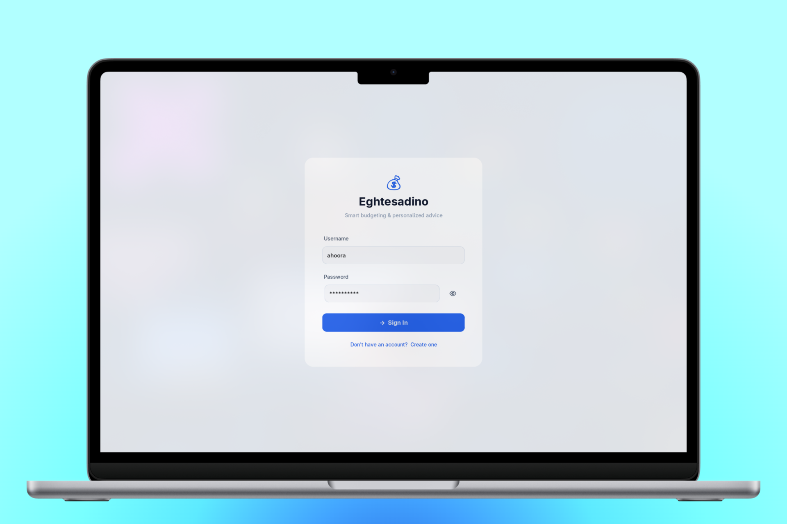
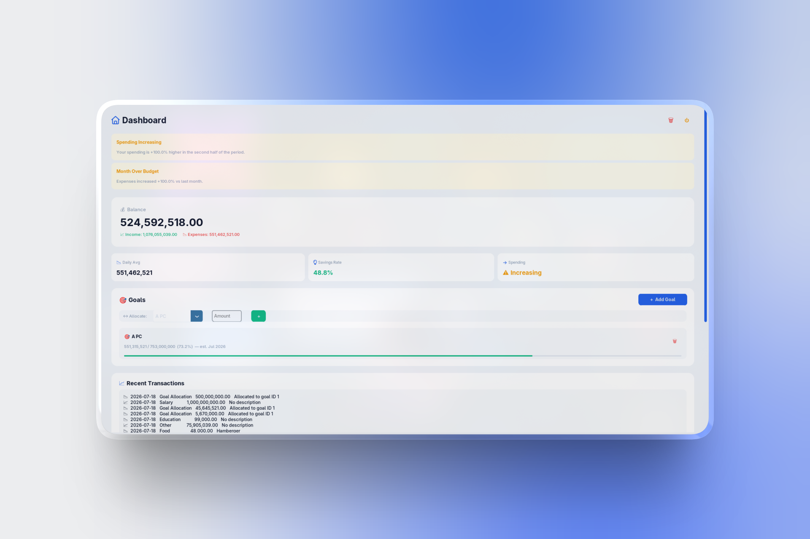
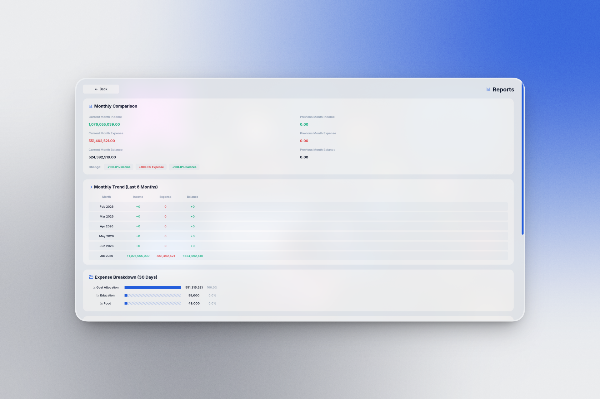
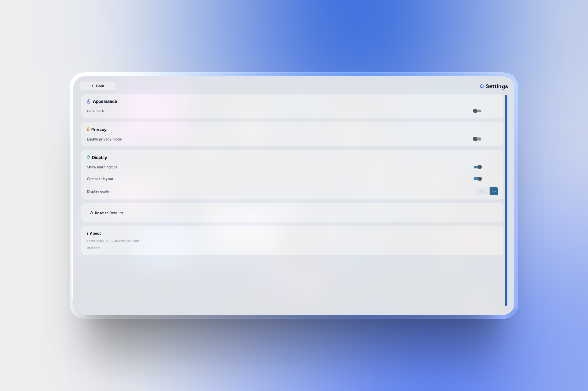

<div align="center">

# Eghtesadino

**A modern personal finance desktop application for university students**

[](https://www.python.org/)
[](LICENSE)
[](CONTRIBUTING.md)
[](tests/)

Track income, manage expenses, set savings goals, and receive intelligent budgeting insights — all in a clean, modern interface.

[Getting Started](#getting-started) • [Features](#features) • [Screenshots](#screenshots) • [Architecture](#architecture) • [Contributing](#contributing)

</div>

---

## Overview

Eghtesadino is a Python desktop application that helps university students take control of their finances. Built with CustomTkinter for a modern look and feel, it provides real-time balance tracking, spending analysis, and actionable insights to build better financial habits.

**Key highlights:**
- 🔐 Secure authentication with PBKDF2-SHA256 password hashing
- 📊 Real-time analytics and spending velocity indicators
- 🎯 Goal tracking with estimated completion dates
- 🌙 Dark/Light theme with DPI-aware scaling
- 🔒 Field-level encryption for sensitive data

## Features

### Core Functionality
| Feature | Description |
|---------|-------------|
| **User Authentication** | Registration and login with salted PBKDF2-SHA256 password hashing |
| **Transaction Management** | Add income and expense transactions with categories and descriptions |
| **Balance Dashboard** | Real-time balance, income, and expense overview |
| **Goal Tracking** | Create savings goals, allocate funds, and monitor progress |

### Analytics & Insights
| Feature | Description |
|---------|-------------|
| **Spending Insights** | Daily average, top categories, savings rate, and spending velocity |
| **Monthly Comparison** | Side-by-side current vs. previous month with percentage changes |
| **Monthly Trend** | 6-month historical table of income, expenses, and balance |
| **Category Breakdown** | Expense distribution with visual bar charts |
| **Recurring Expense Detection** | Automatic identification of regular expenses |
| **Budget Alerts** | Smart notifications for low savings and rising spending |

### UX & Customization
| Feature | Description |
|---------|-------------|
| **Dark/Light Theme** | Toggle between palettes with live preview |
| **DPI-Aware Scaling** | Automatic screen-resolution scaling with manual override |
| **Compact Layout Mode** | Reduce padding for smaller screens |
| **Learning Corner** | Student-friendly financial tips and recommendations |
| **Privacy Mode** | Toggle-able privacy setting per account |

## Screenshots

<div align="center">

| Login | Dashboard |
|:-----:|:---------:|
|  |  |

| Reports | Settings |
|:-------:|:--------:|
|  |  |

</div>

> **Note:** Add your screenshots to `assets/screenshots/` directory.

## Getting Started

### Prerequisites

- Python 3.10 or later
- `pip` package manager

### Installation

```bash
# 1. Clone the repository
git clone https://github.com/Itsahoora/Eghtesadino-Finance-App-.git
cd Eghtesadino-Finance-App-

# 2. Create and activate a virtual environment
python -m venv .venv
source .venv/bin/activate   # Linux / macOS
# .venv\Scripts\activate    # Windows

# 3. Install dependencies
pip install -r requirements.txt

# 4. Run the application
python main.py
```

The SQLite database (`financial_data.db`) is created automatically on first launch.

### Quick Start

1. **Register** a new account from the login screen
2. **Sign in** with your credentials
3. **Add transactions** using the form at the bottom of the dashboard
4. **Create savings goals** via the "Add Goal" button
5. **View Reports** for monthly comparison, category breakdown, and spending insights
6. **Customize** theme, privacy mode, and layout from Settings

## Architecture

```
┌──────────────────────────────────────────────────┐
│                     main.py                      │
│         FinancialApp  (screen router)            │
└──────────┬────────────┬────────────┬─────────────┘
           │            │            │
    ┌──────▼──┐  ┌──────▼──┐  ┌─────▼─────┐
    │ Screens │  │ Models  │  │   Utils   │
    │ (UI)    │  │ (Logic) │  │ (Shared)  │
    └─────────┘  └─────────┘  └───────────┘
```

### Project Structure

```
Eghtesadino-Finance-App-/
├── main.py                        # Application entry point
├── models/
│   ├── __init__.py
│   └── financial_advisor.py       # Business logic & database layer
├── screens/
│   ├── __init__.py
│   ├── login_screen.py            # Authentication UI
│   ├── dashboard_screen.py        # Main hub: balance, transactions, goals
│   ├── reports_screen.py          # Analytics & reporting
│   ├── settings_screen.py         # Theme, privacy, display settings
│   └── add_goal_screen.py         # Goal creation form
├── utils/
│   ├── __init__.py
│   ├── constants.py               # Categories, icons, spacing tokens
│   ├── colors.py                  # Theme-aware color accessor
│   ├── scale.py                   # DPI scaling utilities
│   ├── theme_manager.py           # Theme singleton (dark/light toggle)
│   ├── ui_components.py           # Reusable widgets (Card, Labels, etc.)
│   └── theme/
│       ├── __init__.py
│       ├── colors.py              # Light & dark color palettes
│       └── sizes.py               # Design tokens (font sizes, radii)
├── tests/
│   ├── test_financial_features.py # Unit tests for core features
│   └── run_theme_tests.py         # Theme smoke tests
├── assets/
│   └── screenshots/               # Application screenshots
├── docs/
│   └── REPOSITORY_REVIEW.md       # Codebase review & findings
├── .github/
│   ├── ISSUE_TEMPLATE/            # Bug report & feature request templates
│   ├── pull_request_template.md   # PR template
│   └── workflows/
│       └── python.yml             # CI pipeline
├── requirements.txt               # Python dependencies
├── CONTRIBUTING.md                 # Contribution guidelines
├── CHANGELOG.md                   # Version history
├── LICENSE                        # MIT License
└── README.md                      # This file
```

## Technologies

| Layer | Technology |
|-------|------------|
| Language | Python 3.10+ |
| GUI Framework | [CustomTkinter](https://github.com/TomSchimansky/CustomTkinter) |
| Database | SQLite 3 (via `sqlite3` stdlib) |
| Password Hashing | PBKDF2-HMAC-SHA256 (200,000 iterations) |
| Field Encryption | XOR stream cipher with PBKDF2-derived key |
| Theme Engine | Custom `ThemeManager` singleton with listener pattern |
| Scaling | DPI-based auto-scaling with `sv()` helper |

## Security Features

- **Password Hashing** — Passwords are hashed with PBKDF2-HMAC-SHA256 using a random 16-byte salt per user and 200,000 iterations
- **Field-Level Encryption** — Transaction categories and descriptions are encrypted at rest using an XOR stream cipher with a key derived from PBKDF2 (120,000 iterations)
- **SQL Injection Prevention** — All database queries use parameterized statements
- **Configurable Pepper** — The encryption pepper can be overridden via the `EGHTESADINO_PEPPER` environment variable

## Configuration

### Environment Variables

| Variable | Description | Default |
|----------|-------------|---------|
| `EGHTESADINO_PEPPER` | Encryption pepper for field-level encryption | `eghtesadino-student-finance-v3` |

### User Settings

Settings are stored per-user in the database:
- `privacy_enabled` — Toggle privacy mode
- `show_learning_tips` — Show/hide learning corner tips
- `compact_mode` — Reduce padding for smaller screens

## Testing

```bash
# Run all tests
python tests/test_financial_features.py
python tests/run_theme_tests.py

# Run specific test file
python -m pytest tests/test_financial_features.py -v
```

## Future Improvements

- [ ] Export reports to CSV/PDF
- [ ] Budget limits per category with visual indicators
- [ ] Recurring income detection
- [ ] Multi-currency support
- [ ] Data backup and restore
- [ ] Chart-based visualizations (matplotlib integration)
- [ ] Mobile companion app

## Contributing

Contributions are welcome! Please read our [Contributing Guidelines](CONTRIBUTING.md) before submitting a PR.

1. Fork the repository
2. Create a feature branch (`git checkout -b feature/your-feature`)
3. Commit your changes (`git commit -m "Add your feature"`)
4. Push to the branch (`git push origin feature/your-feature`)
5. Open a Pull Request

## Changelog

See [CHANGELOG.md](CHANGELOG.md) for a list of changes.

## License

This project is licensed under the MIT License — see the [LICENSE](LICENSE) file for details.

## Author

**Ahoora** — [Itsahoora](https://github.com/Itsahoora)

*Built for students, by students*

---

<div align="center">

**[Back to Top](#eghtesadino)**

</div>
